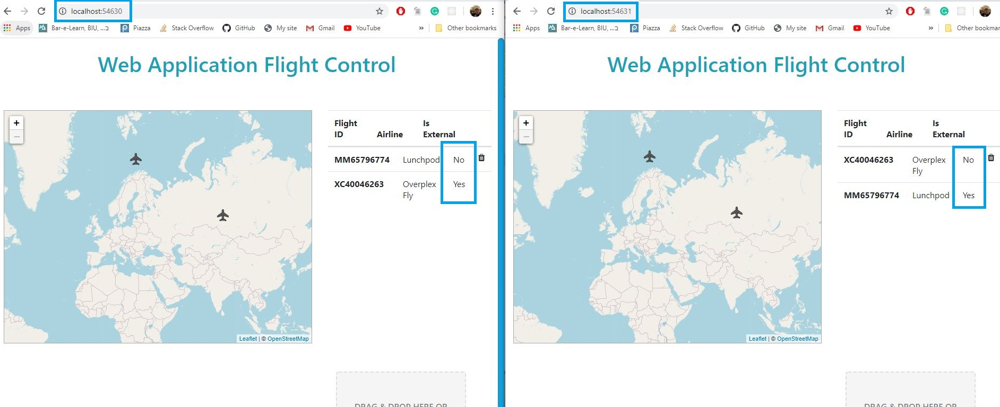
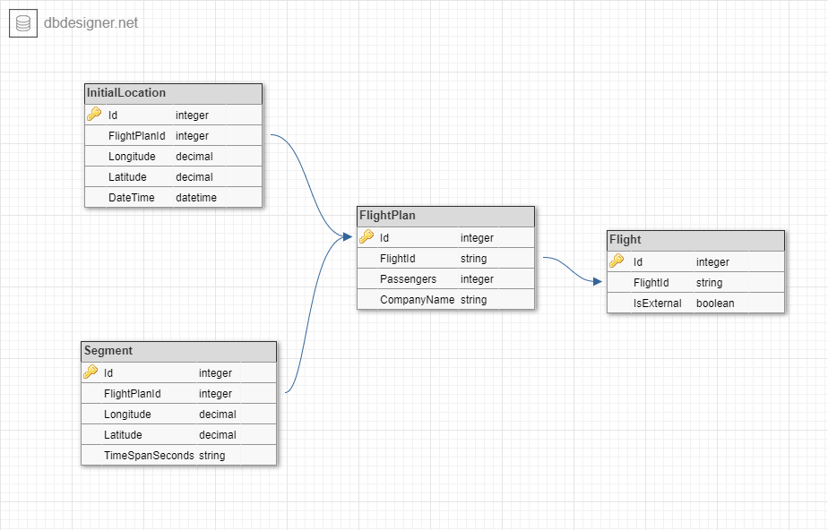

# FlightControl
Advanced Programming 2 course, Flight Simulator App

Created by: Almog Lev, Eyal Golan, Sapir Deutscher and Ofir Netzer.

## Preview

A flight control web application that interacts with a dedicated server. 

We built our frontend using Javascript, bootstrap and css. The backend was built using C# and ASP.NET Core, we created a RESTful API using WebAPI and the DB was built using Entity Framework. Unit Tests were created using Moq.

The web application features a flight control system that presents current active flights, enables adding new flight plans and show details about each flight (it's path on a map, it's start time and arrival time, etc). 


## Program explanation

### Adding Flights

The user can add a flight by by adding a flight plan json using the drag and drop feature.

The flight plan json is in the following structure:

```
{
  "passengers": 257,
  "company_name": "ISRAIR",
  "initial_location": {
    "longitude": 21.239979,
    "latitude": 32.026706,
    "date_time": "2020-06-03T13:30:00Z"
  },
  "segments": [
    {
      "longitude": 23.240702,
      "latitude": 34.921971,
      "timespan_seconds": 1000
    },
    {
      "longitude": 21.346370,
      "latitude": 39.419221,
      "timespan_seconds": 2000
    }
  ]
}
```

### Interacting with external servers

The application can also connect with external servers and show their flights (And vice versa):



### DB structure

We used an in-memory Entity Framework DB, that contained several tables: 

* FlightItems - Used to store internal flights
* ExternalFlightItems - Used to store external flights
* FlightPlanItems - Used to store flight plans of internal flights
* InitialLocationItems - Used to store initial locations of internal flights
* SegmentItems - used to store the flight segments of internal flights
* ServerItems - used to store the external servers the application is getting exteranl flights from


