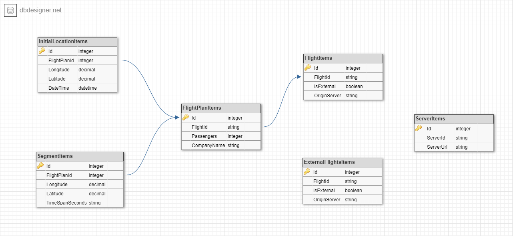

# FlightControl
Advanced programming 2 course, flight control web application

Created by: Almog Lev, Eyal Golan, Sapir Deutscher and Ofir Netzer.

## Preview

A flight control RESTful web application.

We built our frontend using Javascript, JQuery, bootstrap, html and css. 

The backend was built using C#, ASP.NET Core, and Entity Framework (with in-memory SQL DB). We created a RESTful API using WebAPI.
For unit testing we used Moq.

The web application features a flight control system that shows active flights, enables adding new flight plans and shows details about each flight. Upon clicking on a flight, its path is shown on the map.


## Program explanation

### API

The api supports the following actions:

Action | Path | Description
------ | --------- | ----------
GET | /api/Flights?relative_to=<DATE_TIME> | Returns all the internal flights active in DATE_TIME
GET | /api/Flights?relative_to=<DATE_TIME>&sync_all | Returns all flights (internal and external) active in DATE_TIME
POST | /api/FlightPlan | Adds a new flight plan
GET | /api/FlightPlan/{id} | Returns the flight plan with the given id
DELETE | /api/Flights/{id} | Deletes the flight with the given id
GET | /api/servers | Returns all the external servers that provide flight data to the application
POST | /api/servers | Adds a new external server
DELETE | /api/servers/{id} | Deletes the server with the given Id from the external servers list

### Adding Flights

The user can add a flight by dragging a flight plan json file into the drag and drop area.

The structure of a flight plan json is as follows:

```
{
  "passengers": 257,
  "company_name": "ISRAIR",
  "initial_location": {
    "longitude": 21.239979,
    "latitude": 32.026706,
    "date_time": "2020-06-03T13:30:00Z"
  },
  "segments": [
    {
      "longitude": 23.240702,
      "latitude": 34.921971,
      "timespan_seconds": 1000
    },
    {
      "longitude": 21.346370,
      "latitude": 39.419221,
      "timespan_seconds": 2000
    }
  ]
}
```

### Interacting with external servers

The application can also connect with external servers and show their flights:


### DB structure

We use an in-memory SQL DB that contains several tables. We use seperate tables for internal and external flights to make our queries more efficient.


